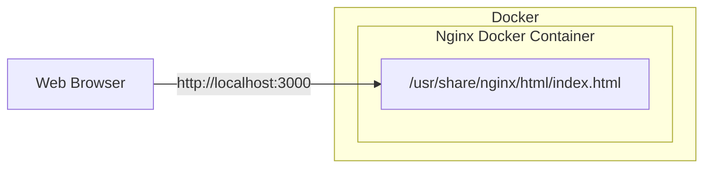

# 3-1. DockerとNginxを利用したサーバーの構築

Nginxのコンテナを1つ利用してDockerでWebサーバーを構築してください。
`http://localhost:3000`にアクセスするとコンテンツが表示されるようにしてください。

本問の解答には`ans-0301`というディレクトリを作成し、その中でディレクトリやファイルを作成してください。

## 目次
- [3-1. DockerとNginxを利用したサーバーの構築](#3-1-dockerとnginxを利用したサーバーの構築)
  - [目次](#目次)
  - [構成図](#構成図)
  - [要件](#要件)
    - [コンテナの起動](#コンテナの起動)


## 構成図


## 要件
- Nginxのイメージは[公式のもの](https://hub.docker.com/_/nginx)を使ってください
- Nginxのイメージは`latest`タグを使ってください
- 解答には`Dockerfile`や`docker-compose.yml`などコンテナを起動するために必要なファイルを含めてください
- 環境を構築するにあたって、必要なら他のファイルを作成しても構いません
- 環境の構築にあたりNginxのコンテナは1つだけ利用してください
- `docker-compose up`を実行することでコンテナを起動できるようにしてください
- `http://localhost:3000`にアクセスすると`Eyemovic employment exam`というテキストが表示されるようにしてください
- `Eyemovic employment exam`というテキストは`/usr/share/nginx/html/index.html`に記載してください

### コンテナの起動
コンテナの起動にはシェルスクリプトを記述したファイルを作成し、それを実行するようにしてください。
例えばコンテナ起動のためのスクリプト`docker-up.sh`を作成し、その中に以下のような内容を記述します。

```
#!/bin/bash
docker compose up --build
```

実行権限を付与します。
```
chmod +x ./docker-up.sh
```

そして`./docker-up.sh`を実行することでコンテナが起動できるようになります。