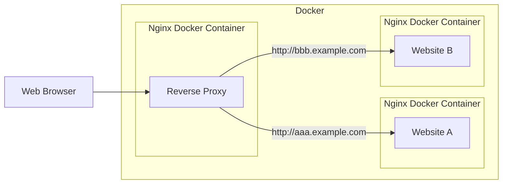

## 3-3. Reverse Proxyの設定
Nginxのコンテナを1つ利用してDockerでWebサーバーを構築してください。
この時別の2台のNginxコンテナに対してReverse Proxyを設定し`http://aaa.example.com`と`http://bbb.example.com`にアクセスするとそれぞれ別のコンテンツが表示されるようにしてください。

[リバースプロキシ](https://www.cloudflare.com/ja-jp/learning/cdn/glossary/reverse-proxy/)

本問の解答には`ans-0303`というディレクトリを作成し、その中でディレクトリやファイルを作成してください。

## 目次
- [3-3. Reverse Proxyの設定](#3-3-reverse-proxyの設定)
- [目次](#目次)
- [構成図](#構成図)
- [要件](#要件)
  - [コンテナの起動](#コンテナの起動)
  - [ドメインとIPアドレスの対応](#ドメインとipアドレスの対応)

## 構成図



## 要件
- Nginxのイメージは[公式のもの](https://hub.docker.com/_/nginx)を使ってください
- Nginxのイメージは`latest`タグを使ってください
- 環境の構築に利用するNginxのコンテナーはReverse Proxy用に1つ、Webサーバー用に2つの計3つを利用してください
- 解答には`Dockerfile`や`docker-compose.yml`などコンテナを起動するために必要なファイルを含めてください
- 環境を構築するにあたって、必要なら他のファイルを作成しても構いません
- `http://aaa.example.com`にブラウザでアクセスすると`aaa.example.com`というテキストが表示されるようにしてください
- `http://bbb.example.com`にブラウザでアクセスすると`bbb.example.com`というテキストが表示されるようにしてください
- Reverse Proxyの設定は`/etc/nginx/conf.d/default.conf`に記載してください

### コンテナの起動
コンテナの起動にはシェルスクリプトを記述したファイルを作成し、それを実行するようにしてください。
例えばコンテナ起動のためのスクリプト`docker-up.sh`を作成し、その中に以下のような内容を記述します。

```
!#/bin/bash
docker compose up --build
```

実行権限を付与します。
```
chmod +x ./docker-up.sh
```

そして`./docker-up.sh`を実行することでコンテナが起動できるようになります。

### ドメインとIPアドレスの対応
`aaa.example.com`と`bbb.example.com`にアクセスするにはドメインとIPアドレスの対応を設定する必要があります。
Unix/Linuxの場合、エディタで`/etc/hosts`を開いて以下を追記してください。(`sudo`が必要な場合があります)

```
127.0.0.1 aaa.example.com bbb.example.com
```

検証が終了した場合は`/etc/hosts`から追記した行を削除してください。
